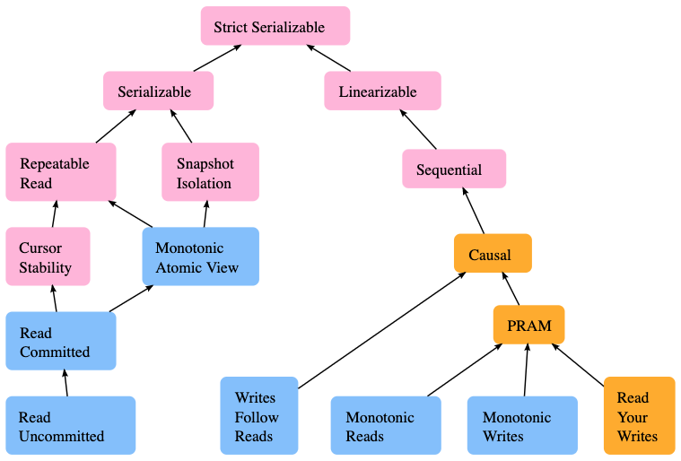

Service invocation is tricky.
The protocol itself seems to be super simple: we call a function, and it returns.
But the problem is, when the function is on another machine,
how we know the state of that machine / the whole system.
The developers of the caller do not want to care, so we protocol designers should care for them.
But trying to make everyone happy is so tough here.

<!-- truncate -->

In this blog, I provide product names and properties of service invocation, so people can look into them and brainstorm.
**Discussing pros and cons is not a goal here**.
Sometimes they are mentioned to make the text "not too thin".
I don't mean to have complete and fair comparisons.

## RPC Protocols

In this section, I want to have a super brief introduction to function call protocols.
From the programmer's view, it's just like calling a special function.

### Microsoft RPC

This is a quite old system designed for C/C++ Windows applications.
The client calls a local stub function, which forwards this calling request to the server stub running on the remote machine.
When the server is done, the result goes the way back.
It's an intrusive solution that requires you to use MS platform and MS compiler.
Even calling itself is not so friendly:

```cpp
// Code from https://docs.microsoft.com/en-us/windows/win32/rpc/the-client-application
status = RpcStringBindingCompose(pszUuid,
                                 pszProtocolSequence,
                                 pszNetworkAddress,
                                 pszEndpoint,
                                 pszOptions,
                                 &pszStringBinding);
if (status) exit(status);
status = RpcBindingFromStringBinding(pszStringBinding, &hello_ClientIfHandle);
if (status) exit(status);
RpcTryExcept
{
  HelloProc(pszString);
  Shutdown();
}
RpcExcept(1)
{
  ulCode = RpcExceptionCode();
  printf("Runtime reported exception 0x%lx = %ld\n", ulCode, ulCode);
}
RpcEndExcept
status = RpcStringFree(&pszStringBinding);
if (status) exit(status);
status = RpcBindingFree(&hello_IfHandle);
if (status) exit(status);
```

All errors are delegated to the programmer.
Network connection problems, insufficient buffer, etc.
All the system does is packing the parameters up and sending through TCP.
I think all kinds of limitations prevent it from being successful.

### HTTP RESTful API

This is probably the most popular RPC protocol.
Of course, HTTP is not designed for function calls.
But when services become resource centric and most functions are CRUD, HTTP does a good job here.

Google Cloud designed RESTful interfaces for nearly all customer-faced APIs.
The following example shows how to list all VM instance groups.

```http
GET /compute/v1/projects/{project}/zones/{zone}/instanceGroups HTTP/1.1
Host: compute.googleapis.com
Content-length: 0
Authorization: Bearer {access-token}
```
The response is:
```http
HTTP/1.1 200 OK
Content-length: 4028
{...}
ETag: {hash-tag}
Cache-control: private
Date: Thu, 06 Aug 2020 01:01:01 GMT
Alt-svc: {...}
Content-type: application/json; charset=UTF-8
Content-encoding: gzip

{
  "items": [
    {
      "kind": "compute#instanceGroup",
      "network": "https://www.googleapis.com/compute/v1/projects/{project}/global/networks/default",
      "zone": "https://www.googleapis.com/compute/v1/projects/{project}/zones/{zone}",
      "name": "gke-cluster2-pool-1234abcd-grp",
      "size": 3,
      "id": "000000000000000000",
      "selfLink": "https://www.googleapis.com/compute/v1/projects/{project}/zones/{zone}/instanceGroups/gke-cluster2-pool-1234abcd-grp",
      "description": "{desc}",
    }
  ],
  "kind": "compute#instanceGroupList",
  "id": "projects/{project}/zones/{zone}/instanceGroups",
  "selfLink": "https://www.googleapis.com/compute/v1/projects/{project}/zones/{zone}/instanceGroups"
}
```

The benefits are
- Simplicity and compatibility.
  - Most languages have mature HTTP libraries.
- Consistent and uniform interfaces.
  - Well-defined HTTP verbs and error codes.
- URI uniquely identifies the resource.
  - Representations can link to other resources easily.
- Caching immutable representations is appropriate.
- Text-based representation is readable by both human users and machines.
- It is easy to document and debug, for both human users and machines.
  - People can use `curl` or other general debugging tools to debug it.
- HTTPS can handle security transparently to programmers.
- There are mature tools which handle monitoring and load balancing for HTTP.
- HTTP naturally supports paging for large results.

CRUD operations are typically designed as follows:

| Method |  Verb  |                   URI                  |
|:------:|:------:|:--------------------------------------:|
|   get  | GET    | /apiname/v1/prefix/collections/objname |
| delete | DELETE | /apiname/v1/prefix/collections/objname |
|  patch | PATCH  | /apiname/v1/prefix/collections/objname |
| update | PUT    | /apiname/v1/prefix/collections/objname |
| insert | POST   | /apiname/v1/prefix/collections         |
|  list  | GET    | /apiname/v1/prefix/collections         |

There is no official way of designing RESTful API. Google's [API Design Guide](https://cloud.google.com/apis/design) may be a good reference.

The original design paper is Roy Fielding's thesis, but I don't believe anyone needs to read it.

### GraphQL

In REST, the format of the resource representation is totally decided by the server side:
- The results may include a lot of fields that the client does not care
- If server-side APIs are upgraded, all clients need to be modified.
- A set of different objects can be fetched in one request.
  - This may be useful for Web UI.

For example, when I open GitHub, it always shows my repos, recent activities, my teams, and followed people's activities.
These are seperated requests in REST but can be compressed into one in GraphQL.

```graphql
# API Gateway: https://api.github.com/graphql (access token required)
query($n: Int) {
  viewer {
    login
    repositories(last: $n){
      nodes {
        name
        url
        createdAt
      }
    }
    followers(first: $n){
      nodes {
        name
      }
    }
  }
}
```

If I send this query with variables `{"n": 2}`,
the response is like

```json
{
  "data": {
    "viewer": {
      "login": "zjkmxy",
      "repositories": {
        "nodes": [
          {
            "name": "zjkmxy.github.io",
            "url": "https://github.com/zjkmxy/zjkmxy.github.io",
            "createdAt": "2020-07-10T06:55:08Z"
          },
          {
            "name": "vmdaemon",
            "url": "https://github.com/zjkmxy/vmdaemon",
            "createdAt": "2020-08-02T08:31:27Z"
          }
        ]
      },
      "followers": {
        "nodes": [
          {
            "name": "{user-name}"
          },
          {
            "name": "{user-name}"
          }
        ]
      }
    }
  }
}
```

I'm not familiar. Some benefits are:
- GraphQL makes frontend developers happier.
- Improve networking performance for Mobile/Web app.
- Non-versioned API.
  - The API gateway can provide the latest document on demand.

I think it's a supplement rather than an alternative of RESTful API for now.
For example, some websites have already used `POST` method for resource fetching in similar scenarios.

### gRPC

gRPC is a binary RPC protocol over HTTP/2, which makes it lightweight and be able to avoid HTTP/1.1 HOL.

gRPC is built on top of Protobuf, a binary serialization library.
Just like Protobuf, all services and messages of gRPC are defined in a `.proto` file.
Client code in multiple programming languages can be automatically generated from this file,
so different code bases can easily sync up.
> Not having to write a client saves significant development time in applications with many services.

gRPC is being used in Google's internal production.
A lot of Google Cloud components have extra support for gRPC, like [traffic director](https://cloud.google.com/blog/products/networking/traffic-director-supports-proxyless-grpc).
I'm not sure, but Google's internal product should have a full stack of support: service discovery, load balancing, authentication,
retry, etc.
These are all the things that an architecturer has to think about, and it can be helpful if the service invocation protocol has already taken them into consideration.
However, external users do not automatically obtain these features,
so in some people's mind gRPC only saves a sidecar or iptables.

gRPC is stricter than HTTP REST. There are lots of specifications and documents about gRPC.
Google Cloud's API Design Guide specifically focuses on gRPC.

gRPC supports both single-side and bidirectional streaming.
An example can be found here: https://github.com/grpc/grpc-go/tree/master/examples/route_guide.
In one word, the non-streaming interface is like function call, and the streaming interface looks like a TCP pipe.

Google also has a [google.longrunning](https://github.com/googleapis/googleapis/blob/master/google/longrunning/operations.proto)
package handling long running operations.

## Other Protocols

There are many other L7 protocols that provide services, but not in a function-call style.

### HTTP Live Streaming

HTTP Live Streaming (aka. HLS) is  widely used video streaming protocol.
(iVisa)[https://ivisa.named-data.net] also uses it on the browser side, with HTTP requests translated to NDN.

The server provides a playlist of all versions (in different resolutions), a video header and fragments.
The client fetches the playlist and then uses it to fetch video fragments it needs.

RFC8216 does not restrict what pipeline the client can use.
It mainly focuses on the format of playlists and how both sides should handle it.
In some sense, NDN-RTC's namespace is similar to this protocol.

### Gossip & Sync

Gossip is not a single protocol but a family of variants.
If we define gossip loosely as follows:
- Disseminate data and embrace eventual consistency
- Reliable communication is not assumed.
- Periodically communicate to some neighbours, rather than a fixed server.
- Do not have any leaders, i.e. fully distributed.

Then, RIP and NDN's Vector Sync can be considered as a variant of gossip.

Gossip is mainly used to maintain an AP database (AP comes A+P of CAP theorem),
whose use cases include data dissemination, event logging, server state sync, and membership management.
Apache Cassandra and HashiCorp Serf use gossip protocols.

As for API, HashiCorp Serf provides the following functions for membership management:
- join, leave
- list
- sendEvent, onEvent
  - Events are eventually consistent and have limited payload
- query
  - Events are "fire-and-forget"; queries can be responded.
  - Both are multicast, but events are eventually delivered to all nodes, while queries may not.
  - Reliability is not guaranteed.

### Pub-Sub

Publish–subscribe system is a many-to-many message system.
- Multiple publishers can send messages to the same topic and multiple subscribers can receive them.
  When a publisher publishes a message, all active subscribers of that topic are supposed to receive the message.
- Publisher and subscribers are decoupled through topics and can be created and destroyed in any order.
  A message can be published to a topic even if there are no active subscribers.

Generally the following APIs are provided
- advertise(topic, arguments)
    This function registers a publisher under topic and returns it.
- publish(publisher, message)
    This function publishes message to the specified topic.
    All currently active subscribers are supposed to receive it if there is no network failure.
- subscribe(topic, callback)
    This function registers a subscriber under topic.
    Whenever some publisher publishes a message, callback should be called with the message.

Pub-sub and message queues are highly related, but pub-sub does not necessarily provide asynchonized queuing
(like MQTT does not by default)
and message queues do not necessarily support multiple producers and consumers.

There are implementation styles for a pub-sub system
- With brokers
  - Implementations include Kafka, Reddis Pub/Sub, and all softwares listed on MQTT website.
    - DDS-XRCE also has an agent, but it behaves differently from traditional brokers.
  - The broker may not be a single node. For example, a Redis cluster.
-  No broker
  - the NDN world and protocols in the DDS family, like DDSI-RTPS, use this style.
    - DDS is not so popular as MQTT, but there are still some industrial users, like robotics.
      I think they are mainly used in neither in-cloud nor customer-facing scenarios.
  - Both NDN-Lite and DDS take advantages of UDP multicast.

### Message Queue

Message queue is a system that provides an asynchronized pipe like TCP:
- A message quque cache the message after a producer sends it out.
- A consumer will receive messages in order.

Basic message queues are mainly used for intra-process communication;
a pub-sub extension is used for network communication to support many-to-many.
Popular products include AMQP implementations (RabbitMQ, ActiveMQ), Kafka, and RocketMQ.
All of them use brokers, since there needs someone to cache messages.
Generally, a broker cluster with a storage service is used.
That service can be another product, like Kafka uses ZooKeeper.

Message queue and pub-sub system can decouple correlated services.
One example from the *Microservice Architecture Design* book explains this:
Suppose we are going to have a online shopping website, where coupons are given to every new registered users.
- Coupons need some time to allocate, but we don't want to add overhead to registration.
- This coupon business changes more frequently than registration.
- Failing to require a coupon should not lead to the failure of registration, as we may compensate them later.

Using a pub-sub system can make registration service unaware of what needs to be done after a successful registration.
Using a queue can further relieve the potential pain caused by speed mismatch.

### Distributed Execution

This is something in my mind.
If we have a series of tasks where each step needs to be run on a different machine, how can we manage this?
WebAssembly has the potential to become a solution to safely execute arbitrary code on a remote machine.

## Properties

This section discusses properties that a service may have, and things designers need to consider.
Again, all materials are listed here to support brainstorm,
which does not imply that a platform or library should implement these.
I'm looking from an architecturer's view,
so I also list some features that are irrelevant to service invocation but still worth considering.

### Communication Model

The NGINX book categorizes IPC into two dimensions: one-to-one vs one-to-many, and sync vs async.

|              |       ONE-TO-ONE       |       ONE-TO-MANY       |
|:------------:|:----------------------:|:-----------------------:|
|  SYNCHRONOUS |    Request/response    |            -            |
| ASYNCHRONOUS |      Notification      |    Publish/subscribe    |
| ASYNCHRONOUS | Request/async response | Publish/async responses |

From the book:
- **Request/response**: A client sends a request to a service and waits for a timely response.
- **Notification**: A client sends a request to a service but no reply is expected.
- **Request/async response**: A client sends a request to a service, which replies asynchronously.
- **Publish/subscribe**: A client publishes a notification message, which is consumed by zero or more interested services.
- **Publish/async responses**: A client publishes a request message, and then waits a certain amount of time for responses from interested services.

### Reliability

I think message queue's reliability concepts applies to general service invocation.

A message queue has three kinds of *delivery guarantees*:
(copied from the blog of Jack Vanlightly, a member of RabbitMQ team)
> - **At-most-once delivery.** This means that a message will never be delivered more than once but messages might be lost.
> - **At-least-once delivery.** This means that we'll never lose a message but a message might end up being delivered to a consumer more than once.
> - **Exactly-once delivery.** The holy grail of messaging. All messages will be delivered exactly one time.

Exactly-once delivery has extra overheads.
For idempotent services, at-least-once may be enough.

AMQP also has two *delivery modes* to indicate durability:
- **Non-persistent.** Messages are not written to disk and lost after crashes.
- **Persistent.** Messages are logged to disk and recovered after the broker restarts.

### Long Running Operations & Storage

Some operations, like starting a VM, can take arbitrarily long time.
Traditional RPC protocols do not support async responses,
but it is still not a good idea to let the client wait until completion.

By API Design Guide, returning a not-ready object is a good idea.
For example,
- The client sends a `create` VM request to the server.
- The server allocates an ID for this VM, puts it into the database and then returns it.
  - Currently this VM is **not** being created.
- The server starts to create the VM.
- The client can use `get` VM request to query the status of the VM at any time.

Since the request is very time consuming, the client does not need the VM as soon as possible.
Thus, a polling from client side is acceptable.

Another problem here is how the client can reach the same server who handles the creation request.
The solution here is *not doing so*, i.e., storing the VM into a *separate* database before creating it,
and letting every server be able to handle it.
- The server may be crashed or upgraded during this creation, but we don't want to interrupt the creation.
- Servers are upgraded more frequently.
- Database's backup and recovery are different from the service's.
- Users may use other means to query the VM. For example, use Web UI to monitor its status after creating it in a terminal.
- Making services *stateless* and *disposal* can make autoscaling easier.

### List Pagination

From the API Design Guide:

> Listable collections should support pagination, even if results are typically small.
> **Rationale**: If an API does not support pagination from the start, supporting it later is troublesome because adding
> pagination breaks the API's behavior. Clients that are unaware that the API now uses pagination could incorrectly
> assume that they received a complete result, when in fact they only received the first page.

An example:
```protobuf
rpc ListBooks(ListBooksRequest) returns (ListBooksResponse);

message ListBooksRequest {
  string parent = 1;
  int32 page_size = 2;
  string page_token = 3;
}

message ListBooksResponse {
  repeated Book books = 1;
  string next_page_token = 2;
}
```

In the case of RESTful API, a query string can be used, like `/rest/api/space/ds/content/page?limit=5&start=5`.

### Timeout & Retry

It is neither user-friendly not reliable to let the client developers handle timeouts and retries.
A wrong solution may take the whole cluster down.
That's why people are developing service mesh, a system which handles all these for developers.
Some systems provide intrusive libraries to handle retry policies (e.g. gRPC, Spring Cloud),
and some systems use sidecar proxies to do so (e.g. Linkerd, Istio).

### Autoscaling

As mentioned before, services are easy to scale when they are *stateless* and *disposal*.
- *Stateless* means the service instances are separated from databases.
  - This may add to the latency.
    However, if services are tied to databases, figuring out which instance holds the requested data is another kind of overhead.
- *Disposal* means it is easy and fast to start up and shut down service instances.
  - Whenever a service is unavailable, we kill it immediate and start up a new instance.
    No need to backup anything.

The data plane of a typical cloud website architecture looks like this:
- Cloud DNS and HTTP load balancers are used as gateways for external traffic.
- Gateways are connected to frontend services
- Frontend services communicate with backend services through internal load balancers.
- Backend services relies on some stateful database services.
  - Backend services are stateless, enabling autoscaling.
- Databases are some standard products, either managed or mature open-source solutions.
  - They are reliable and no need to upgrade frequently.

Autoscaling also requires services have health checks and metrics indicating the workload.
- Health checks can pinging on some port and server-side scripts.
- Metrics can include CPU utilization, latency, queue length, etc.

### Caching

*Distributed caching* can be critical to performance.
I'd like to call it *active caching*.

The reasons why we need distributed in-memory caches are
- CDN only fits in caching static data. Because it is far from the server,
  if we cache dynamic resources, cache invalidation may become a problem.
- Generally, load balancers also cache static resources only.
- Databases and on-disk caches are too slow, so they cannot match the speed of queries.
- Service instances also have L0 caches in memory, but there are some problems
  - The memory may be not enough for caching.
  - Since queries are distributed among backend instances, some frequent query may be cached on all instances,
    which is a waste of memory.

Generally, people deploy a memcached or Redis cluster specifically for active caching.
Data to cache and expiry time are managed by the backend services &mdash; just like a in-memory version of NDN Repo.

3 major problems with caching systems are cache penetration, cache breakdown and cache avalanche.

### Circuit Breaker & Downgrading

Circuit breaker is used to prevent avalanche caused by sudden spikes in latency or sudden failure.
For example, a service A may have bugs and become slow sometimes, and service B is relying on it.
If there is a big traffic to service B, it may keep retrying on service A,
so the result is service B also becomes very slow and may fail.
Circuit breaker prevents this by put a limit on the number of connections, retry times, pending requests, etc.
Therefore, overwhelming traffic can be cut down.

Circuit breaker makes upstream services fail for a while.
If the downstream services cannot recover in a considerable time, service downgrading should be considered.
To downgrade a service, we can
- Remove it from the business. For example, stop issuing coupons.
- Replace it with a simpler version. For example, respond with cached values only, without accessing databases.

### Consistency & Transaction

There are several consistency levels:
- **Strict consistency**: all reads reflect all previous writes in terms of real time. Generally infeasible.
- **Linearizability**: each operation takes some time to finish.
  When a read finishes, it must return the latest state of an object.
  (See the service discovery post for details)
- **Sequential consistency**: all writes are seen globally ordered, though not immediately visible.
- **Causal consistency**: all related writes are seen globally ordered.
  If a service first reads A, then reads B, and makes some decisions based on A and B,
  A and B are considered related.
- **Eventual consistency**: all writes are eventually visible, but may happen out of order.

Transactions are atomic groups of reads and writes.
In RDBMS, transactions are isolated. (the I in ACID)
People uses the following isolation levels to measure this:
- **Read uncommitted**: transactions can see the result of uncommitted transactions. Rarely used in practice.
- **Read committed**: transactions can only see the result of committed transactions.
- **Repeatable read**: reads in the same transaction should see the same dataset
  That is, if some other transactions commit during the first read and the second read of some dataset,
  the second read should not see the changes.
- **Serializable**: all transactions are ordered, with no overlapping allowed.

|  Isolation Level | Dirty Read | Non Repeatable Read | Phantom |
|:----------------:|:----------:|:-------------------:|:-------:|
| Read uncommitted |     Yes    |         Yes         |   Yes   |
|  Read committed  |     No     |         Yes         |   Yes   |
|  Repeatable read |     No     |          No         |   Yes   |
|   Serializable   |     No     |          No         |    No   |

Traditional RDBMS uses locks to implement ACID.
Distributed database systems do not necessarily support transactions.
For example, Hadoop only supports single-row transactions.



### Ordering

Sometimes we want to have a global ordering over all operations.
From an architecturer's view, this can be done by something like a message queue.
But this only delegates the problem without solving it &mdash; after all, the message queue system needs to worry about this.

There are several methods to provide a global ordering:
- **Synchronized clock**: Google's Cloud Spanner uses TrueTime, a globally deployed time system.
- **One-node ordering**: use one node, like the elected leader, to generate a timestamp for each operation.
- **Lamport Timestamps**: Lamport algorithm provides a logical timer which provides casual ordering, where related operations are ordered correctly. See [Wiki](https://en.wikipedia.org/wiki/Lamport_timestamp).

If we use DLedger (or a similar system) for async invocation, and take the ledger as a tracing system,
then we automatically have a casual ordering.
In this sense, DLedger can be considered as a shared, casually-ordered message queue.

### Security Trade-off

A lot of cloud systems use standalone services for authentication and authorization.
This is of course insecure, but it works most of the time and simple enough to prevent potential bugs.

There are trade-offs between security and other things. For example,
- Distributing RBAC configuration to all nodes is difficult -> stand-alone service for authorization.
- Infeasible to let all nodes do 2FA -> stand-alone service for authentication.
- Byzantine fault happens very rarely in a managed system -> use simpler but not Byzantine Fault tolerant algorithms.

### Observability

> Observability to better understand cluster status, quickly debug and more
> deeply understand systems to architect more resilient and stable systems
> moving forward.

To debug microservices, it's important to have a global view of the whole cluster.
- **Centralized log.** There should be a way to collect logs printed by programs running on every node.
- **Metrics.** Monitoring and recording metrics of all machines, containers and services.
- **Tracing.** A trace is a collection of all events happening in a single request.
  It records what services are called with their start and end time.

Google's Dapper is a distributed logging system used on Google cloud.
Zipkin is an open-source implementation of Dapper.

Istio supports automatic metrics, logs, and traces for all traffic within a cluster.
It also works with different tracing backends.
This is one of the popular features of Istio.

### Internal vs External

There are three different types of traffic:
- Internal, or *east-west*: in-cluster traffic.
- External, Internet-facing, or *north-south*: traffic that goes to or comes from outside of the cluster.
- Peer to peer.

In an IP cloud, there should be ingress and egress firewalls to protect the cluster from being attacked and attacking others.
Depending on implementation details, there may be no firewalls between in-cluster nodes.
In NDN world, every packet is signed and verified, so there is no fundamental different between these kinds of traffic.

In terms of service invocation, a small difference is the choice of libraries.
Internal traffic may use some specific library that developers like,
but external traffic generally use REST or GraphQL, which are more general and independent to specific languages and libraries.

### Description

To let human users and computers understand the capabilities of APIs, descriptions about APIs are needed.

- **OpenAPI** provides a standard, language-agnostic interface to RESTful APIs
  which allows both humans and computers to discover and understand the capabilities of the service.
  It is written in json or yaml.
- For gRPC users, **proto** file with comments can be used as documentation.
- GraphQL supports querying the schema, by querying `__schema` field.
  There are also other metadata fields like `__type`.

A machine-readable doc enables general debugging tools like **GraphQL Playground** and **Fiddler**.

### Intrusion

Some libraries or platforms require developers to use specific languages or systems.
Istio makes use of sidecars to provide a non-intrusive way to support all its fancy features.

### Complexity

How to balance the complexity is a tricky part of microservices design.
Here I can give some examples
1. Migrating a monolith program into microservices reduces the complexity of single programs,
  but adds to the complexity of communication.
2. In Kubernetes, pods can be managed by developments, stateful sets or humans.
  If we put them under the namespace of specific developments, we may add the complexity of operating on them.
  A better way is letting pods be objects independent of who manages it,
  and providing a mapping between pods and its owner.
  However, this imports another service into the system.
3. When choosing libraries, who is going to maintain it become a problem.
  If we build everything on our own, we may not have enough manpower.
  If we use some open source software, we delegate debugging and maintaining issues to other teams,
  which raises the complexity of management.

### Business Model

Not every hard problems need to be solved.
Tomorrow's business may be very different from today's.
If we think something is obsolete and tricky, we can choose not to support it.
For example, in NDN world, we may want to support less cloud IaaS business and more P2P business.

## Service Mesh's Issues

There are too many features that operators want but they are too much for developers to implement.
Thus, the concept of **service mesh** rises.
From Istio's doc:
> The term service mesh is used to describe the network of microservices that make up such applications and the
> interactions between them. As a service mesh grows in size and complexity, it can become harder to understand and
> manage. Its requirements can include discovery, load balancing, failure recovery, metrics, and monitoring. A service mesh
> also often has more complex operational requirements, like A/B testing, canary rollouts, rate limiting, access control, and
> end-to-end authentication.
>
> Istio provides behavioral insights and operational control over the service mesh as a whole,
> offering a complete solution to satisfy the diverse requirements of microservice applications.

However, the complexity cannot be eliminated &mdash; it's delegated to the service mesh developers.
Especially when the lower layer, TCP/IP, is not designed for service-centric & data-centric usage.
Too many dirty hacks are used here, from proxy daemons ([Envoy](https://www.envoyproxy.io)) to kernel hooking ([Cilium](https://cilium.io)).

> Nice idea, not nearly ready for production.

Istio is a good start, whose idea is really fancy.
However, the implementation is too tough, so there are many annoying potholes and crappy dirty-hacks.
Some exposed problems are briefly listed here
- "Unfortunate architectural decisions around Mixer":
  Istio wanted to separate data plane (sidecars) and control plane.
  Thus, it separates Mixer out of Envoy, making it to handle access control systems, telemetry capturing systems,
  quota enforcement systems, billing systems, and so forth.
  However, this doubles every service call &mdash; the sidecar needs to contact Mixers first and then services.
  At last, Mixer was abandoned due to severe performance issue.
- Istio decided to refactor to monolithic control plane. The reason is stated [here](https://istio.io/latest/blog/2020/istiod).

There are many other annoying issues, including
- Authenticate a workload identity in another system
- Manipulating iptables seems to be not a good solution to load balancing. It also has performance issue if the table is too big.
- CNI and sidecar-based data plane are too complex that operators cannot debug them well.
- Other "ancestral sin" in TCP/IP design, like Nagle's algorithm impedes the performance of real-time streaming.

## References

- Microsoft. [Remote Procedure Call](https://docs.microsoft.com/en-us/windows/win32/rpc/rpc-start-page). May 31, 2018.
- Google Developers. [OAuth 2.0 Playground](https://developers.google.com/oauthplayground).
- The GraphQL Foundation. [GraphQL](https://graphql.org). 2020.
- James Newton-King. [Compare gRPC services with HTTP APIs](https://docs.microsoft.com/en-us/aspnet/core/grpc/comparison?view=aspnetcore-3.1). Microsoft AspNetCore.Docs. Dec 5, 2019.
- Google Cloud. [API Design Guide](https://cloud.google.com/apis/design). Jul 22, 2020.
- Microsoft Azure Architecture Center. [Web API design](https://docs.microsoft.com/en-us/azure/architecture/best-practices/api-design). Jan 12, 2018.
- George Mao. [How to Architect APIs for Scale and Security](https://aws.amazon.com/blogs/architecture/how-to-architect-apis-for-scale-and-security). Amazon Web Services. Jul 30, 2019.
- RFC8216. [HTTP Live Streaming](https://tools.ietf.org/html/rfc8216). Aug, 2017.
- Peter Gusev, Jeff Burke. [NDN-RTC: Real-time videoconferencing over Named Data Networking](https://named-data.net/wp-content/uploads/2015/07/NDNTR-0033-ndnrtc.pdf). NDN Tech Report NDN-0033. Jul 2, 2015.
- Tianxiang Li, Zhaoning Kong, Spyridon Mastorakis, Lixia Zhang. [Distributed Dataset Synchronization in Disruptive Networks](https://named-data.net/wp-content/uploads/2019/11/sync-ad-hoc-paper-1.pdf). IEEE MASS 2019. Nov, 2019.
- Serf. [Getting Started](https://www.serf.io/intro/getting-started/install.html). Dec 21, 2017.
- micro-ROS. [DDS-XRCE, MQTT & IoT](https://micro-ros.github.io/docs/concepts/middleware/IoT). Jan 23, 2020.
- DDSI-RTPS authors.[DDS Interoperability Wire Protocol](https://www.omg.org/spec/DDSI-RTPS/About-DDSI-RTPS). Object Management Group. May, 2019.
- Amazon Web Services. [What is a Message Queue?](https://aws.amazon.com/message-queue). 2020.
- Eran Stiller. [RabbitMQ vs. Kafka](https://medium.com/better-programming/rabbitmq-vs-kafka-1ef22a041793). Feb 6, 2020.
- Chris Richardson, Floyd Smith. Microservices: From Design to Deployment. NGINX, Inc. 2016.
- Jack Vanlightly. [RabbitMQ vs Kafka Part 4 - Message Delivery Semantics and Guarantees](https://jack-vanlightly.com/blog/2017/12/15/rabbitmq-vs-kafka-part-4-message-delivery-semantics-and-guarantees). Dec 15, 2017.
- Zhenyu Jiang. [Microservice Architecture Design](https://gudaoxuri.gitbook.io/microservices-architecture). Apr 23, 2019.
- Istio Authors. [Traffic Management](https://istio.io/latest/docs/tasks/traffic-management). Aug 14, 2019.
- Iqbal Khan. [Scale Out - Distributed Caching On The Path To Scalability](https://docs.microsoft.com/en-us/archive/msdn-magazine/2009/brownfield/distributed-caching-and-scalability). MSDN Magazine Volume 24 Number 07. Jul, 2009.
- Confluence Server Developer Documentation. [Pagination in the REST API](https://developer.atlassian.com/server/confluence/pagination-in-the-rest-api). Mar 4, 2020.
- Daniel Abadi. [Overview of Consistency Levels in Database Systems](http://dbmsmusings.blogspot.com/2019/07/overview-of-consistency-levels-in.html). DBMS Musings. Jul 25, 2019.
- Microsoft SQL Docs. [Understanding isolation levels](https://docs.microsoft.com/en-us/sql/connect/jdbc/understanding-isolation-levels?view=sql-server-ver15). Aug 12, 2019.
- Jaana Dogan. [Things I Wished More Developers Knew About Databases](https://medium.com/@rakyll/things-i-wished-more-developers-knew-about-databases-2d0178464f78). Apr 21, 2020.
- Cloud Spanner Documentation. [Cloud Spanner: TrueTime and external consistency](https://cloud.google.com/spanner/docs/true-time-external-consistency). Jun 22, 2020.
- Swagger. [OpenAPI Specification Version 3.03](https://swagger.io/specification/). Feb 20, 2020.
- SE Daily. [Service Mesh Wars with William Morgan](https://softwareengineeringdaily.com/2019/05/31/service-mesh-wars-with-william-morgan). May 31, 2019.
- Xiaojian Ao. [Istio Performance Issue](https://skyao.io/post/201904-istio-performance-issue). Apr 23, 2019.
- Christian Posta. [Istio as an Example of When Not to Do Microservices](https://blog.christianposta.com/microservices/istio-as-an-example-of-when-not-to-do-microservices/). 2020.
- Bilgin Ibryam. [Operators and Sidecars Are the New Model for Software Delivery](https://thenewstack.io/operators-and-sidecars-are-the-new-model-for-software-delivery/). May 22, 2020.
- Zach Jory. [The Top 3 Service Mesh Developments in 2020](https://thenewstack.io/the-top-3-service-mesh-developments-in-2020). Dec 12, 2019.
- Envoy doc. [xDS REST and gRPC protocol](https://www.envoyproxy.io/docs/envoy/latest/api-docs/xds_protocol)
